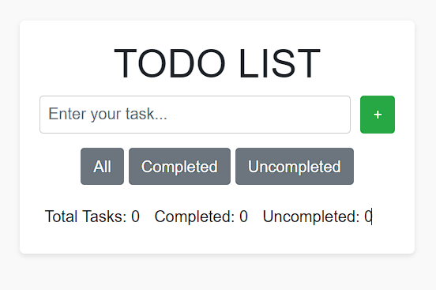

# Todo List

A simple Todo list application built with vanilla JavaScript, HTML, and CSS. This project allows users to create, mark as completed, and delete tasks in a minimal and user-friendly interface.

## Demo

Try out the [Todo List](https://your-hosted-website-url.com) application!

## Features

- Minimal design with HTML and CSS, no libraries or frameworks used.
- Add tasks using the text box at the top.
- Click the "+" button to add a new task to the list.
- Each task has a delete button (X) to remove it from the list.
- Tasks can be marked as completed using checkboxes.
- Completed tasks are differentiated from uncompleted tasks.
- The application displays the total number of tasks, completed tasks, and uncompleted tasks.

## Getting Started

To run the Todo List application, simply open the `index.html` file in your web browser.

## Usage

1. Enter a task in the text box at the top.
2. Click the "+" button to add the task to the list.
3. To mark a task as completed, check the corresponding checkbox.
4. To delete a task, click the "X" button next to the task.
5. Use the filter buttons (All, Completed, Uncompleted) to show specific sets of tasks.

## Contributing

Contributions to this project are welcome! If you find any issues or have suggestions for improvements, feel free to create an issue or submit a pull request.

